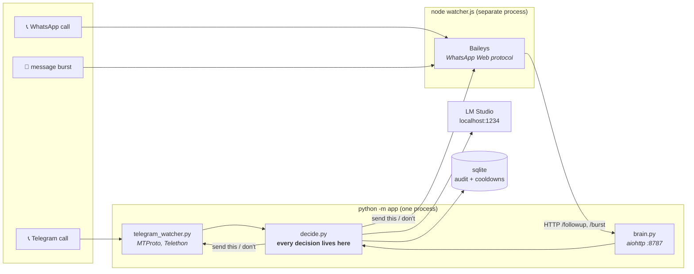
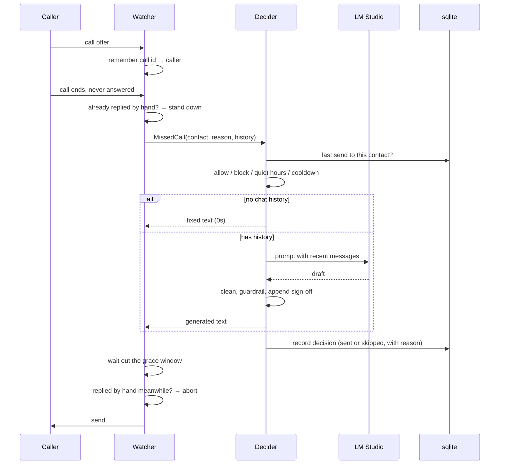
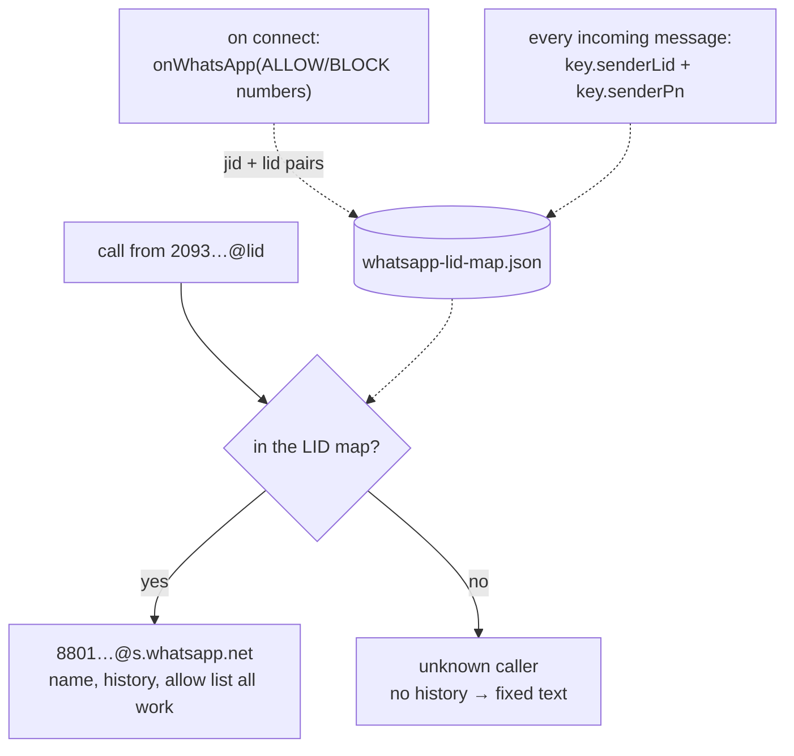
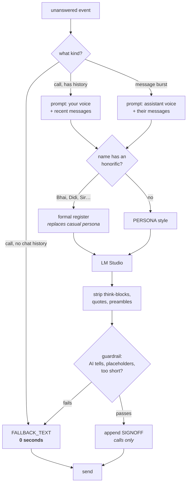
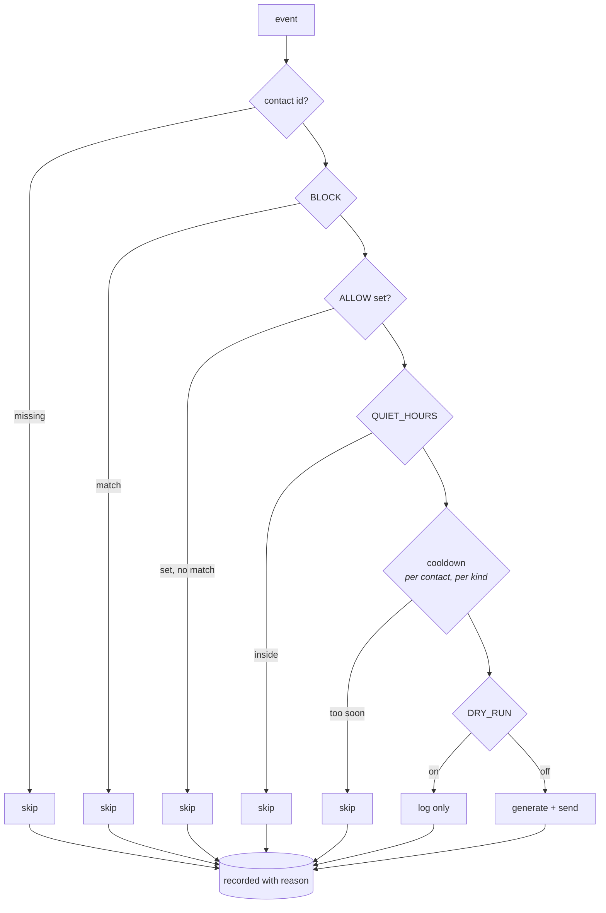

# Architecture

How this thing is put together, and why. Most of the non-obvious decisions here
came from something breaking in production — those are called out as they come
up, because the reasoning matters more than the code.

---

## 1. The shape of it

Two processes. One brain, two watchers.



**Why two processes.** Baileys is Node-only and Telethon is Python-only. There
is no single runtime that speaks both protocols, so the split is forced. What
*isn't* forced is where the logic lives: the watchers know only how to detect an
event and how to send a message. Every judgement — should we reply, what should
it say, have we already replied — is in `decide.py`. That is why Telegram and
WhatsApp behave identically despite sharing no code.

**Why the Telegram watcher skips the HTTP hop.** It runs in the same process as
the brain, so it calls `Decider` directly. The HTTP endpoint exists only because
the Node process can't.

---

## 2. What happens when a call comes in



The **two stand-down checks** are not redundant. Generation takes 25–85 seconds
on a local reasoning model, which is ample time for you to answer by hand. The
first check saves the compute; the second is the one that actually prevents
talking over yourself. This was added after a live call where the follow-up
arrived a minute *after* a manual "wait".

---

## 3. Detecting an unanswered call

This is the part that looks trivial and isn't. Both platforms lie to you in
different ways.

### WhatsApp

Baileys emits `call` events with a status derived from the stanza's tag:

| Tag | Status | Means |
| --- | --- | --- |
| `offer` / `offer_notice` | `offer` | ringing started |
| `terminate` + `reason=timeout` | `timeout` | rang out |
| `terminate` (any other reason) | `terminate` | answered, rejected, **or** caller hung up |
| `reject` | `reject` | **this client** rejected it |
| `accept` | `accept` | picked up |

The trap: `reject` is only produced when Baileys itself rejects. It is tempting
to listen for `reject` + `timeout` and call it done — and depending on the
client, declining on your phone can arrive as a bare `terminate` instead, which
is indistinguishable from a call you *answered*.

So the watcher tracks `offer` and treats any ending it never saw an `accept` for
as unanswered. `WHATSAPP_TERMINATE_AS_MISSED=false` narrows it to unambiguous
endings if that heuristic ever misfires.

### Telegram

`PhoneCallDiscarded` carries a call id, a reason and a duration — **not the
caller**. So the watcher caches `call_id → caller` from `PhoneCallRequested` and
looks it up on discard.

Outgoing calls filter themselves out for free: calls you place produce
`PhoneCallWaiting`, not `PhoneCallRequested`.

One irreducible ambiguity: `PhoneCallDiscardReasonHangup` is reported both when
*you* reject and when the *caller* gives up. Nothing distinguishes them — the
rejection happens on your phone, not in this client.

### LIDs — the one that silently broke everything

WhatsApp increasingly addresses people by an opaque **LID** rather than a phone
number. A real call arrives as:

```
call event: status=offer from=209384756102938@lid
```

Nothing in that identifies the caller. An allow list written in phone numbers
matches nothing, so every call is skipped — silently, if your code filters on
`@s.whatsapp.net` and moves on. Baileys exposes no lookup for it.



The map is built two ways because neither alone is enough: pre-resolution covers
people you've configured but never messaged, and message-learning covers
everyone else over time.

**The ALLOW/BLOCK trade-off:**

| Config | Pros | Cons |
| --- | --- | --- |
| `ALLOW=` (empty) | Everyone gets a reply; no manual allow-list maintenance | First-call LID strangers get fixed text; history appears after ~1-2 messages |
| `ALLOW=phone1,phone2,…` | Configured contacts get history + generated message on first call | Strangers get silence; manual maintenance burden |

An empty `ALLOW` doesn't disable replies — it enables them for *everyone*. It only
disables LID pre-resolution, which is a performance trade-off, not a correctness one.
Most callers arrive as phone JIDs (`@s.whatsapp.net`), so they're matched and resolved
immediately. LID pre-resolution only matters for the small fraction of first-time LID
callers, and even then they get a working reply — just not personalized until the map
learns their number.

---

## 4. Choosing the words



**Why no model call for a contextless missed call.** With an empty chat the
model has nothing to personalise from — it would spend 15–30 seconds producing
something no better than the fixed line. The rule is simply *is there context
worth using*.

**Why the sign-off is appended, not requested.** A model told to sign drops the
signature whenever the message feels too short to warrant one. So the prompt
forbids signing and the code stamps it on, with a duplicate check that ignores
case, spacing and punctuation.

**Why honorifics are matched as whole words.** `di` and `da` are two letters. A
substring match fires on *Nadia*, *Sandip*, *Adam*, *Dawood*, *Madan*, *Dipa*.
The name is tokenised and each token checked for exact membership.

**Why the no-excuse rule names specific lies.** "Don't invent excuses" was not
enough — the model produced *"Sorry, I missed your call due to an emergency"*,
which is a false statement made to a real person on your behalf. The rule now
enumerates them: not busy, not asleep, not driving, not in a meeting, not an
emergency.

---

## 5. Local models

Everything runs against LM Studio on `localhost:1234`. No data leaves the
machine. Two properties of local reasoning models shape the whole design:

**They think before they write.** Hundreds of tokens go to `reasoning_content`
before a single character reaches `content`. Set `max_tokens` too low and you
get an empty string with `finish_reason: "length"` — which reads like a broken
endpoint but is plain truncation.

**Reasoning length is nondeterministic.** The same prompt produced 227 reasoning
tokens on one run and blew past 700 on the next. So a budget that works most of
the time still fails intermittently, silently dropping to fallback text. Hence a
generous `MAX_TOKENS` and a config check that refuses anything under 400.

`DISABLE_THINKING` sends `chat_template_kwargs: {enable_thinking: false}`, which
some chat templates honour and others ignore entirely — if the request is
rejected for it, the client retries once without rather than degrading to fixed
text. **A non-reasoning instruct model is 10× faster here**; nothing about
writing one casual sentence benefits from deliberation.

---

## 6. Safety layers

Every one exists because auto-messaging real people is easy to get wrong.



| Layer | What it prevents |
| --- | --- |
| `DRY_RUN` | anything reaching a real person before you've read a few |
| `ALLOW` | the blast radius during testing — strangers get silence |
| `BLOCK` | specific people, always |
| `QUIET_HOURS` | a 4am auto-text |
| cooldown | repeat calls producing repeat messages |
| grace window + stand-down | talking over a reply you sent by hand |
| guardrail | AI tells and `[your name]` placeholders going out |
| fallback | silence when the model is down |

**Cooldowns are per contact *and* per kind.** A `kind` column separates call
follow-ups from burst replies, so one can't suppress the other.

**A send is recorded before it is attempted.** If the send then fails, the
cooldown is still burnt. That is the safe direction: one missing follow-up beats
a duplicate storm at someone's phone.

**Every decision is written to sqlite** — sent or skipped, with the reason. The
audit trail is the only way to answer "why did it message them?" after the fact.

---

## 7. Files

```
app/
  __main__.py          entry point: brain + Telegram watcher in one loop
  config.py            .env → frozen Settings dataclass, validated at startup
  models.py            MissedCall / MessageBurst / Message / Decision
  decide.py            the single decision path both platforms use
  gating.py            allow / block / quiet hours / cooldown (pure functions)
  compose.py           prompts, honorific detection, cleaning, guardrails, sign-off
  llm.py               async LM Studio client
  store.py             sqlite cooldowns + audit trail, with migrations
  brain.py             HTTP endpoints for the Node watcher
  telegram_watcher.py  Telethon MTProto call + message detection
whatsapp/watcher.js    Baileys call + message detection, LID mapping
scripts/selftest.py    pre-flight: config, model, database, pairing, a sample message
scripts/service.sh     launchd management for both processes
data/                  sessions, auth, sqlite, LID map   ← never commit
logs/                  rotating logs from both processes ← never commit
```

**`data/` holds full account credentials** — `telegram.session` is a complete
login to your Telegram account, `whatsapp-auth/` the same for WhatsApp. Both are
gitignored. Treat them like passwords.

---

## 8. Observability

Both processes log to `logs/` in **local time** — the Node side formats
timestamps by hand, because `toISOString()` is UTC and made the two logs look
hours apart when read side by side.

**Every call event is logged unconditionally, including skips and why.** This is
a deliberate reversal: the original code skipped silently, and when a real
missed call produced no follow-up there was no way to tell whether the event had
never arrived or had arrived and been dropped. Silent skips make a system
undebuggable exactly when you need to debug it.

```bash
./scripts/service.sh status        # both services, brain health, recent activity
./scripts/service.sh logs          # follow both
curl -s localhost:8787/recent      # every decision, with its reason
uv run python scripts/selftest.py  # pre-flight, sends nothing
```
